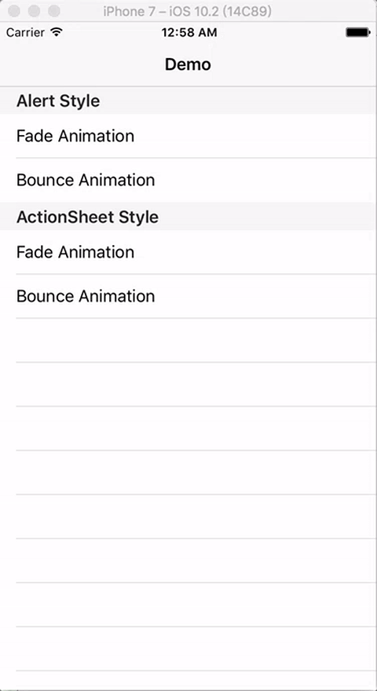

# AAAlertController


[](https://travis-ci.org/aozhimin/AAAlertController)
[](http://cocoapods.org/pods/AAAlertController)
[](http://cocoapods.org/pods/AAAlertController)
[](http://cocoapods.org/pods/AAAlertController)

# Overview
`AAAlertController` is a lightweight UI component to present a popup style dialog, it's easy to use and integrate in your project. The API is just like `UIAlertController` which you will see the usage in demo

## Sample project
We provided sample project, To run the it, after you clone the repo, open the workspace file.



## Requirements
`AAAlertController ` works on iOS 7.0+ and requires ARC to build.


## Installation

`AAAlertController` is available through [CocoaPods](http://cocoapods.org). To install
it, simply add the following line to your Podfile:

```ruby
pod "AAAlertController"
```

and edit pod file, install `AAAlertController` into your project just excute command as follow:

```ruby
pod install
```

## Usage
(see the usage which I put in the sample project)

```objective-c
    AAPresentViewController *popupVC = [[UIStoryboard storyboardWithName:@"Main" bundle:nil]
                                        instantiateViewControllerWithIdentifier:@"AAPresentViewController"];
    popupVC.view.frame = CGRectMake(0, 0, 300, 300);
    AAAlertController *alertController = [[AAAlertController alloc] initWithContentViewController:popupVC
                                                                               andAnimationOption:animationOption];
    [self presentViewController:alertController animated:YES completion:nil];
```

## Author
|Author|Gmail|Twitter|
|:---:|:----:|:----:|
|Alex Ao|aozhimin0811@gmail.com|[@Alex Ao](https://twitter.com/aozhimin0811)|

## License

`AAAlertController` is available under the MIT license. See the LICENSE file for more info.
